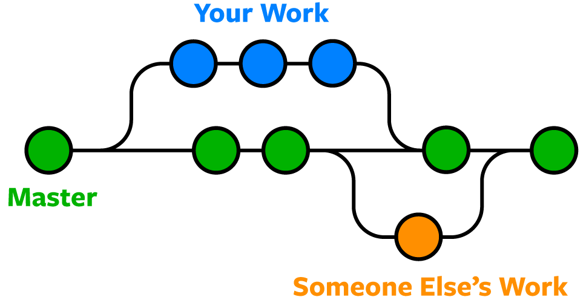

At first glance, this class seemed like a deep dive into web development—tools like Next.js, Tailwind, PostgreSQL, and Bootstrap all pointed in that direction. But as the semester progressed, it became clear that the real takeaway wasn’t just how to build a website—it was how to *think* like a software engineer. Through this course, I’ve gained a new appreciation for the patterns, principles, and ethics that guide how software is designed, structured, and maintained. Some of the most lasting lessons came from learning about coding standards, design patterns, functional programming, user interface frameworks, development environments, and the ethical responsibilities of writing software.

---

## Why Coding Standards Matter

Before this course, my coding habits were messy but functional. I could write code that *worked*, but returning to it after a break was like trying to read notes written in a foreign language. It wasn’t until I adopted proper coding standards that I saw how transformative structure can be. Clean code isn't just easier to read—it’s easier to debug, easier to expand, and, most importantly, easier for others to work with. I learned that formatting, naming conventions, and consistent logic aren’t just for aesthetics—they’re about respect for your future self and your collaborators.

Whether it was sticking to a common structure across files or using meaningful variable names, coding standards brought a kind of mental rhythm to our projects. It’s like cleaning up your workspace—you feel more focused, more capable, and less overwhelmed.

---

## Recipes That Scale: Design Patterns in Action

If coding standards are the grammar of software, then **design patterns** are the recipes. I didn’t fully appreciate them until we started building *Manoa Munchies*, a full-stack project with multiple moving parts. As the project grew, so did the complexity—until we started applying patterns like **Strategy** and **Factory** to keep things under control.

The **Strategy Pattern** helped us create flexible menu logic for vendors. Instead of hardcoding one way to handle specials or daily changes, we created strategies the system could choose based on context. Meanwhile, the **Factory Pattern** simplified how we created menu items, letting us generate them efficiently without rewriting the same setup.

More than anything, design patterns gave us a common language—a way to talk through solutions and make design decisions as a team without having to reinvent the wheel.

---

## Functional Programming: Thinking in Smaller Pieces

The core idea behind **functional programming**—writing pure functions that avoid side effects and return predictable outputs—became clearer as I worked with array methods, map/filter chains, and data transformations.

Rather than writing a big loop that did everything at once, I learned to compose smaller functions together like building blocks. It made debugging easier and gave me more confidence in reusing and testing individual components.

In team projects, keeping functions pure and predictable helped us avoid bugs and made our code easier to maintain. It’s a mindset I’ll carry with me no matter what language or framework I use in the future.

---

## Development Environments: Your Tools Shape Your Work

Tools like **Visual Studio Code**, **GitHub**, **Prettier**, and **ESLint** transformed the way I worked. These aren’t just conveniences—they’re part of the workflow. They help catch errors early, keep code visually consistent, and streamline collaboration.

A good development environment is like a well-stocked kitchen—it doesn’t cook the meal for you, but it makes it a whole lot easier and more enjoyable.

---

## UI Frameworks: From Frustration to Fluidity

I started the semester relying heavily on raw HTML and CSS, and I honestly found my first experience with **Bootstrap 5** pretty frustrating. The class-based system felt rigid and unfamiliar. But once I got the hang of it, I saw how much time and energy a UI framework could save.

Bootstrap’s prebuilt components, grid system, and responsive design tools allowed me to build polished interfaces with minimal styling. More importantly, it ensured consistency across the app, especially when collaborating with others.

Over time, the frustration turned into fluency, and I came to appreciate UI frameworks not just as shortcuts—but as essential tools for scalable and maintainable design.

---

## Ethics in Software: More Than Just Code

Software doesn’t exist in a vacuum. Every app, every algorithm, every feature has real-world consequences—whether it’s influencing user behavior, collecting personal data, or affecting accessibility.

Being a good software engineer means more than writing efficient code. It means considering who the code serves, what it protects, and what harm it could cause. Are we designing interfaces that include everyone? Are we transparent about how user data is handled?

With great software comes great responsibility. And that responsibility lies not just in the product, but in the process behind it.

---

## Final Thoughts

This course taught me far more than how to build a web app. It taught me how to build software *well*. From applying coding standards that keep things organized, to using design patterns that scale with complexity, to thinking functionally, using the right tools, and acting ethically, I now see software engineering as both a technical and human-centered craft.

The tools and frameworks may change over time, but the principles I’ve learned—clarity, collaboration, adaptability, and responsibility—will stick with me in whatever I build next.
